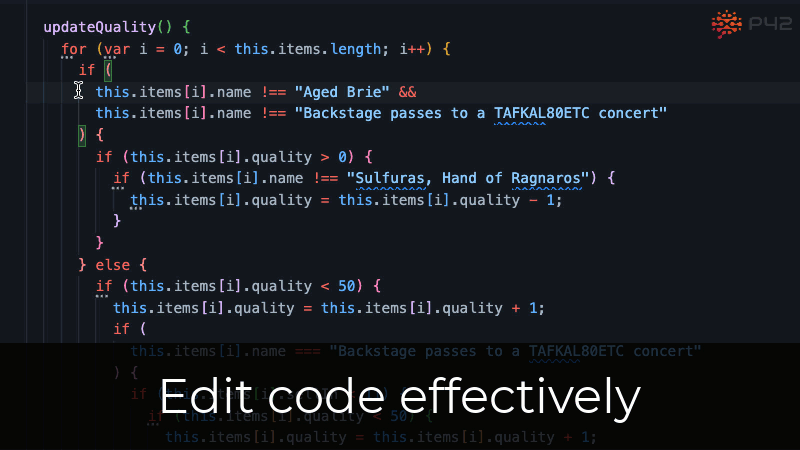

# Edit code effectively
Manually editing JavaScript code is often cumbersome and error-prone. With the P42 JS Assistant, you can **use fast, automated code assists and refactorings to modify your code accurately on a structural level** and focus on what change you want to make, not on what to type.

# Learn modern JavaScript on the fly

JavaScript and its ecosystem are rapidly progressing, and it is time-consuming to stay up-to-date. The P42 JS Assistant shows **suggestions for using modern JavaScript syntax and APIs** so you can write clean code without spending time catching up on the latest JavaScript features.

# Refactor safely
Refactorings, especially those that are performed manually, can easily break existing functionality or introduce bugs. The JS Assistant **automates refactoring steps and analyses the safety of potential refactorings**, so you can refactor with confidence and know what to consider to avoid unnecessary breakages.