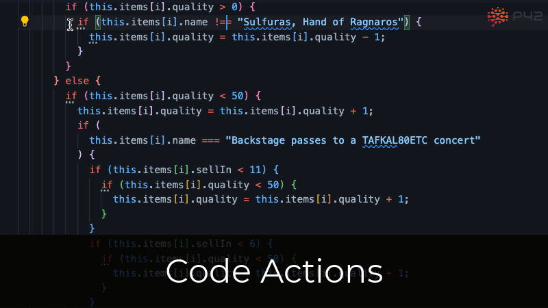

  

Code actions are context-specific, automated operations that modify your code. They encapsulate common intentions such as "extract variable" or "add {…}" and can execute them quickly and accurately.

# How can I invoke code actions?
The easiest ways to invoke code actions are the quick-fix and the refactor context menus, which you can open with keyboard shortcuts:

| | Mac shortcut | Windows/Linux shortcut |
| :-- | --: | --: |
| **Quick Fix** | <kbd>⌘</kbd> + <kbd>.</kbd> | <kbd>Ctrl</kbd> + <kbd>.</kbd> |
| **<ins>R</ins>efactor** |  <kbd>⌃</kbd> + <kbd>⌘</kbd> + <kbd>R</kbd> | <kbd>Ctrl</kbd> + <kbd>Alt</kbd> + <kbd>R</kbd> |

You can also open the quick-fix context menu with your mouse by clicking the light bulb that appears in your editor.

# What can I do with code actions?
There are many different categories of code actions. The most common ones are:

* **Rewrite**: Convert between different idioms. Update your code to use modern JavaScript patterns.
* **Extract**: Structure your code and remove duplication by extracting variables, strings, and React functional components.
* **Inline**: Streamline your code by inlining variables and assignments.
* **Move**: Re-order your code to make it easier to understand.
* **Rename**: Change variable, function, and class names.

The available code actions depend on the cursor position, the selected text (if any), the source code, the language type, and any available type information.

# Learn more
* [All code actions in the P42 JS Assistant](https://p42.ai/documentation/code-assist)