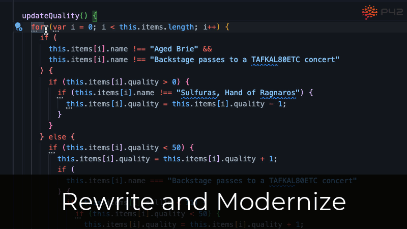

# Rewrite code with automated actions
You can rewrite a code element by placing the cursor on it and invoking the quick-fix or refactor context menus. For example, you can [invert conditions](https://p42.ai/documentation/code-assist/invert-condition) on the condition expression of an if-statement.

# Modernization suggestions

The P42 JS Assistant sometimes recommends modern JavaScript patterns. The triple-dotted underline in the editor indicates that a suggestion is available. You can hover over it to see a details pop-up and trigger a quick fix inline from there. 

> 💡&nbsp;&nbsp;You can also find all suggestions for the currently active editor in the P42 suggestions view.

# Toggle braces {…}
You can toggle `{…}` directly with a keyboard shortcut:

|  | Mac shortcut | Windows/Linux shortcut |
| :-- | --: | --: |
| **Toggle <ins>b</ins>races {}** | <kbd>⌃</kbd> + <kbd>⌘</kbd> + <kbd>B</kbd> | <kbd>Ctrl</kbd> + <kbd>Alt</kbd> + <kbd>B</kbd> |

Depending on your cursor position, it will toggle the braces for the closest element, e.g., an if statement, or show a context menu with different targets for toggling braces.

# Available rewrite actions
* [Convert loop to .forEach](https://p42.ai/documentation/code-assist/convert-loop-to-for-each)
* [Convert function to object method](https://p42.ai/documentation/code-assist/convert-function-to-object-method)
* [Use nullish coalescence in default expression](https://p42.ai/documentation/code-assist/use-nullish-coalescence-in-default-expression)
 * [More...](https://p42.ai/documentation/code-assist-list/keyboard-shortcut/refactor.rewrite)